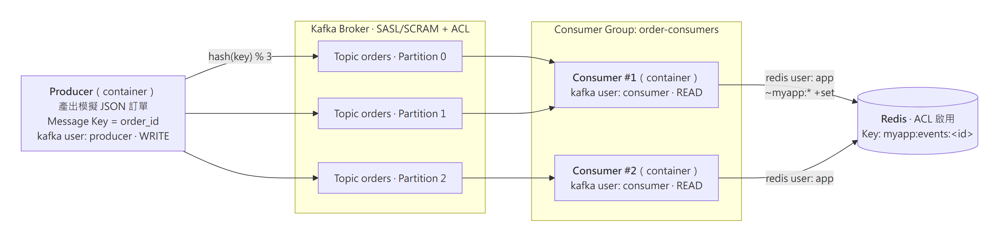
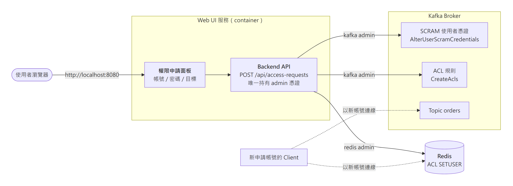
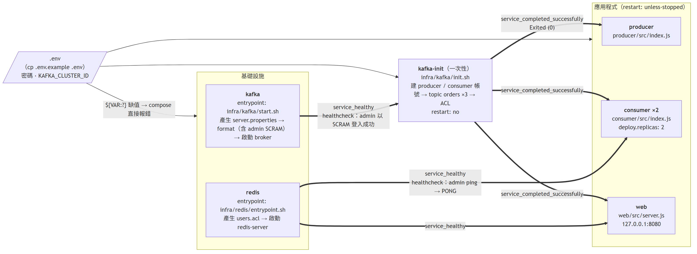
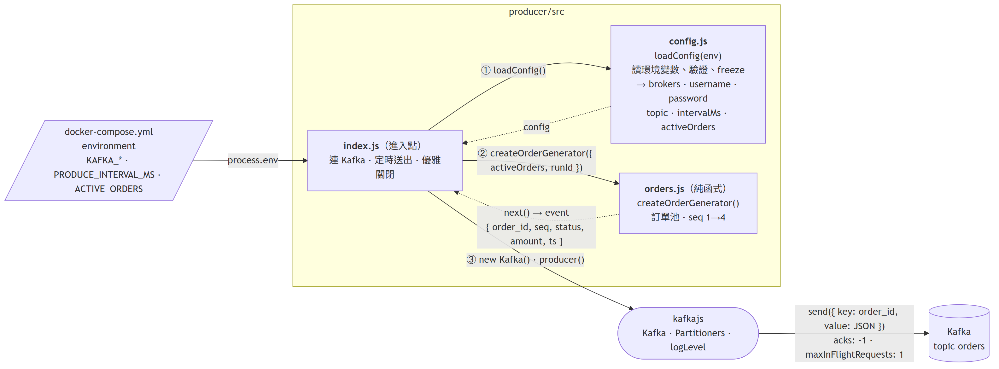
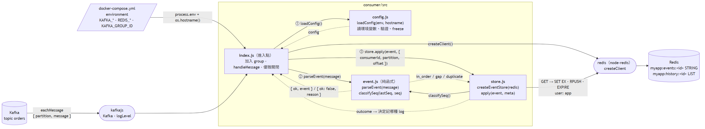
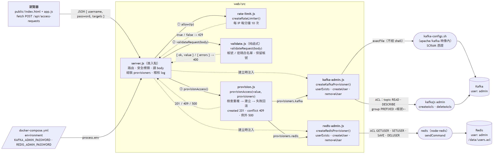

# Kafka × Redis 整合與 ACL 權限控制

> 題目原文見 [ASSIGNMENT.md](ASSIGNMENT.md)。

Producer（Node.js）持續送出模擬訂單到 Kafka，兩個 Consumer 實體以同一個 Consumer Group 分擔 partition，寫入 Redis `myapp:*`。Kafka 與 Redis 都啟用 ACL，每個元件只拿到最小權限帳號。加分題的權限申請面板可在網頁上動態建立 Kafka / Redis 帳號。





## 1. 啟動

```bash
cp .env.example .env
docker compose up --build -d
docker compose ps            # kafka / redis 為 healthy，kafka-init 為 exited (0)
```

- 權限申請面板：<http://localhost:8080>
- 管理 UI（選用）：Kafbat UI、Redis Insight，見[第 5 節](#5-管理-ui選用)
- port 被占用時，在 `.env` 改 `WEB_HOST_PORT`（預設 8080）或 `REDIS_HOST_PORT`（預設 6379）
- 重設全部資料：`docker compose down -v`

### 啟動順序



kafka healthy → kafka-init 建好帳號、topic、ACL 並以 exit 0 結束 → producer / consumer / web 才啟動；consumer 與 web 另外等 redis healthy。

### 目錄與程式結構

| 目錄 | 內容 |
|---|---|
| `producer/` `consumer/` `web/` | 三個 Node.js 服務，各有 Dockerfile 與 `npm test` 單元測試 |
| `infra/kafka/` | broker 啟動（KRaft + SASL/SCRAM）與一次性初始化（帳號、topic、ACL） |
| `infra/redis/` | 依 `.env` 產生 ACL 檔後啟動 Redis |
| `scripts/check-order.sh` | 從 Redis 驗證順序性與負載平衡 |

各服務 `src/` 內的檔案關係（實線為呼叫，虛線為回傳，①②③ 為處理順序）：

**Producer**



**Consumer**



**Web（權限申請面板）**



## 2. 帳號與 ACL 配置

密碼都在 `.env`（範本見 [.env.example](.env.example)），限 12 碼以上英數字。

### Kafka（SASL/SCRAM-SHA-512）

Topic `orders`，3 個 partition。`allow.everyone.if.no.acl.found=false`（沒有 ACL 就拒絕）、`auto.create.topics.enable=false`。

| 帳號 | 用途 | 權限 |
|---|---|---|
| `admin` | broker 間通訊、初始化、面板後端 | super user |
| `producer` | Producer | `orders`：Write、Describe |
| `consumer` | Consumer × 2 | `orders`：Read、Describe；group `order-consumers`：Read |
| 面板申請的帳號 | 唯讀查詢 | `orders`：Read、Describe；group 限 `<帳號>-` 開頭 |

用 SCRAM 而非 PLAIN：PLAIN 的帳號寫死在 JAAS 設定檔，執行期無法新增，加分題做不到。

### Redis（ACL）

| 帳號 | 用途 | 權限 |
|---|---|---|
| `default` | — | 停用，禁止無密碼存取 |
| `admin` | healthcheck、面板後端 | 全部 |
| `app` | Consumer 寫入 | key 限 `myapp:*`；指令限 `get set exists expire ttl rpush lrange` 與連線所需指令 |
| 面板申請的帳號 | 唯讀查詢 | key 限 `myapp:*`；指令限 `get exists ttl type strlen lrange llen` |

## 3. 驗證

### ACL 生效

```bash
# Redis：無密碼被拒 → NOAUTH
docker compose exec redis sh -c 'unset REDISCLI_AUTH; redis-cli ping'

# Redis：app 只能動 myapp:* → OK / NOPERM key / NOPERM command
docker compose exec redis sh -c 'redis-cli --no-auth-warning --user app --pass "$REDIS_APP_PASSWORD" set myapp:events:test ok'
docker compose exec redis sh -c 'redis-cli --no-auth-warning --user app --pass "$REDIS_APP_PASSWORD" set other:key nope'
docker compose exec redis sh -c 'redis-cli --no-auth-warning --user app --pass "$REDIS_APP_PASSWORD" flushall'
```

Kafka 的正反向測試需要 client 設定檔，先在 Kafka 容器內建好：

```bash
set -a; . ./.env; set +a
mkprops() { printf 'security.protocol=SASL_PLAINTEXT\nsasl.mechanism=SCRAM-SHA-512\nsasl.jaas.config=org.apache.kafka.common.security.scram.ScramLoginModule required username="%s" password="%s";\n' "$1" "$2" | docker compose exec -T kafka sh -c "cat > /tmp/$1.properties"; }
mkprops admin    "$KAFKA_ADMIN_PASSWORD"
mkprops producer "$KAFKA_PRODUCER_PASSWORD"
mkprops consumer "$KAFKA_CONSUMER_PASSWORD"
```

再用 `kafka-console-producer.sh` / `kafka-console-consumer.sh` 搭配 `/tmp/<帳號>.properties` 測試：

| 測試 | 預期 |
|---|---|
| 錯誤密碼 | `Authentication failed ... invalid credentials` |
| producer 寫入 `orders` | 成功 |
| consumer 以 `order-consumers` 讀取 | 成功 |
| producer 嘗試讀取 | `GroupAuthorizationException` |
| consumer 使用其他 group | `GroupAuthorizationException` |
| consumer 嘗試寫入 | `ClusterAuthorizationException` |

### 兩個 Consumer 分擔工作

```bash
docker compose exec kafka /opt/kafka/bin/kafka-consumer-groups.sh \
  --bootstrap-server kafka:9092 --command-config /tmp/admin.properties \
  --describe --group order-consumers
```

預期 3 個 partition 分屬兩個不同的 `CONSUMER-ID`，`LAG` 接近 0。

停掉一個實體，剩下的會接手全部 partition；加回來後重新分配：

```bash
docker compose up -d --scale consumer=1 --no-recreate consumer
docker compose logs consumer | grep group_joined | tail -1    # [0,1,2]
docker compose up -d --scale consumer=2 --no-recreate consumer
docker compose logs consumer | grep group_joined | tail -2    # 分成兩份
```

### 相同 Key 保持順序

Producer 的 Message Key 為 `order_id`，每筆訂單帶連續遞增的 `seq`；Consumer 把每次處理寫進 `myapp:history:<order_id>`。

```bash
bash scripts/check-order.sh
```

預期 `seq_not_contiguous=0 multi_partition=0`（每個 key 的 seq 連續，且只出現在一個 partition），exit code 0；並列出每個 partition 由哪個實體處理。

順序保證的做法：相同 key 落在同一 partition（murmur2）、`maxInFlightRequests: 1`、`acks: -1`；Consumer 處理完才 commit offset（at-least-once），並依 `seq` 略過重送的訊息。

## 4. 加分題：權限申請面板

1. 開 <http://localhost:8080>，輸入帳號（例如 `team-a`）與 12 碼以上英數字密碼，勾選 Kafka / Redis，送出。
2. 約 2 秒後顯示建立完成與授予的權限（固定唯讀，見第 2 節）。
3. 同名帳號再送一次 → 「帳號已存在」；帳號填 `producer` → 「系統保留帳號」。

API 也可直接呼叫：

```bash
curl -s -H 'Content-Type: application/json' \
  -d '{"username":"team-b","password":"ExamplePass2026","targets":["kafka","redis"]}' \
  http://localhost:8080/api/access-requests
```

| 情境 | 回應 |
|---|---|
| 新帳號 | `201`，不含密碼 |
| 帳號已存在 | `409` |
| 保留帳號、格式不符 | `400` |
| 非 JSON / body 超過 4KB / 每分鐘超過 10 次 | `415` / `413` / `429` |

用新帳號確認權限是唯讀：

```bash
mkprops team-b ExamplePass2026
docker compose exec -T kafka /opt/kafka/bin/kafka-console-consumer.sh \
  --bootstrap-server kafka:9092 --consumer.config /tmp/team-b.properties \
  --topic orders --group team-b-g1 --from-beginning --max-messages 2 --timeout-ms 20000   # 讀得到

docker compose exec redis redis-cli --no-auth-warning --user team-b --pass ExamplePass2026 set myapp:x 1   # NOPERM
```

安全設計：admin 憑證只注入 web 容器；內建帳號列為保留、已存在帳號不覆寫；帳號密碼格式白名單且不經 shell；回應與 log 不含密碼；建立失敗會回滾；Redis 帳號以 `ACL SAVE` 持久化，重啟後仍在。

## 5. 管理 UI（選用）

兩個 UI 放在 compose 的 `ui` profile，預設不啟動，不影響上面的流程：

```bash
docker compose --profile ui up -d                          # 啟動（核心服務沒起來時會一併啟動）
docker compose --profile ui stop kafbat-ui redisinsight    # 只停 UI
```

| UI | 網址 | 連線 | 帳號 |
|---|---|---|---|
| Kafbat UI | <http://localhost:8081> | `kafka:9092`，SASL/SCRAM-SHA-512 | Kafka `admin` |
| Redis Insight | <http://localhost:5540> | `redis:6379`，啟動時自動登錄連線 | Redis `admin` |

- 兩者都用 admin 連線，可讀可改，port 與其他服務一樣只綁 `127.0.0.1`。
- port 被占用時，在 `.env` 改 `KAFBAT_HOST_PORT`（預設 8081，避開面板的 8080）或 `REDISINSIGHT_HOST_PORT`（預設 5540）。
- Redis Insight 第一次開啟會顯示使用條款，同意後才進得去。

**Kafbat UI 可以看什麼**

- Topics → `orders`：3 個 partition；Messages 分頁可看每筆事件的 key、partition、offset，相同訂單號的事件都在同一個 partition。
- Consumers → `order-consumers`：兩個 member 各分到哪些 partition，以及 lag。
- ACL：`producer` / `consumer` 與面板申請帳號的權限，對照第 2 節。

**Redis Insight 可以看什麼**

- Browser：篩選 `myapp:*`，`myapp:events:*` 是訂單最新狀態（string），`myapp:history:*` 是處理歷程（list），兩者都有 TTL。
- Workbench：直接下指令，例如 `ACL LIST` 看全部帳號（含面板建立的）。

Redis Insight 改用 `app` 帳號會連得上但列不出 key：Browser 需要 `SCAN`，而 `app` 的指令白名單沒有它。

## 已知限制

- 單節點 Kafka、全程 `SASL_PLAINTEXT` 無 TLS，只適合 lab。
- 面板沒有登入與審核，申請的帳號也沒有到期或撤銷機制；正式環境需補上。
- kafkajs 已停止維護，正式專案建議改用 `@confluentinc/kafka-javascript`。
